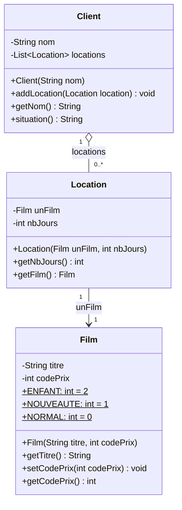
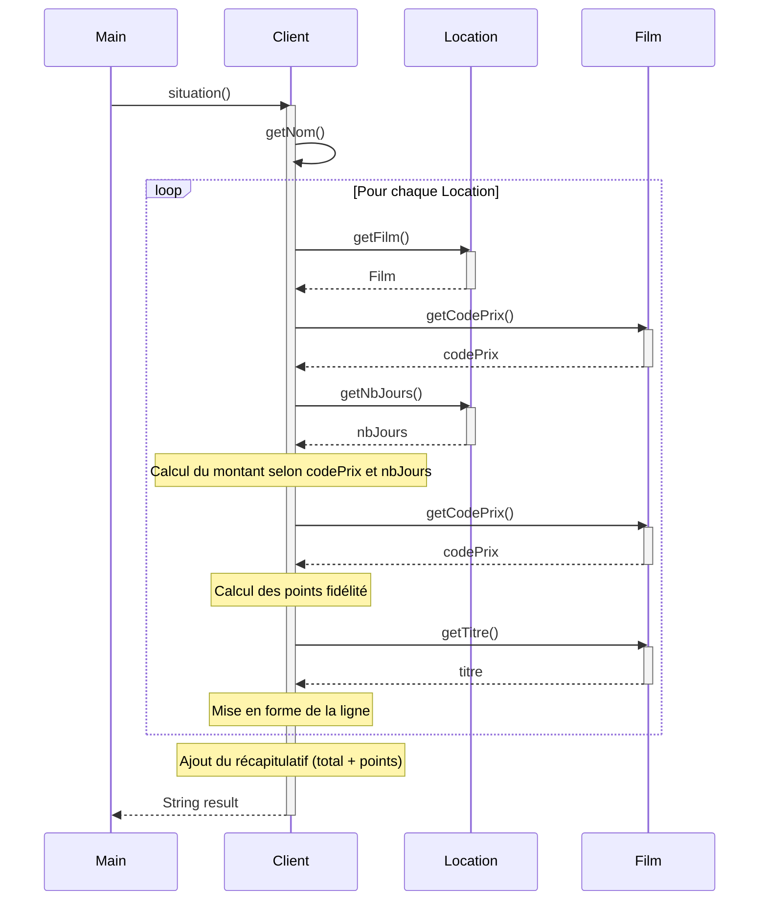

# Système de Location de Films - Documentation

## 1. Fonctionnalité principale

Ce code implémente un **système de gestion de locations de films** pour un vidéoclub. Il permet de :
- Gérer des clients et leurs locations de films
- Calculer le montant dû pour chaque location selon le type de film
- Accumuler des points de fidélité
- Générer une situation récapitulative pour un client

---

## 2. Règles métiers

### Tarification selon le type de film :

| Type de Film | Tarif de base | Supplément |
|--------------|---------------|------------|
| **NORMAL** | 2€ | +1.5€/jour au-delà de 2 jours |
| **NOUVEAUTE** | 3€/jour | - |
| **ENFANT** | 1.5€ | +1.5€/jour au-delà de 3 jours |

### Points de fidélité :
- **1 point** par location (quel que soit le type)
- **+1 point bonus** pour les nouveautés louées au moins 2 jours

---

## 3. Diagramme de classes



**Multiplicités :**
- Un `Client` possède **0 à plusieurs** `Location` (agrégation)
- Une `Location` est associée à **exactement 1** `Film`

---

## 4. Diagramme de séquences



---

## 5. Tests unitaires

Les tests JUnit sont disponibles dans `src/ClientTest.java`. Ils couvrent :

- ✅ Film NORMAL (≤2 jours et >2 jours)
- ✅ Film NOUVEAUTE (1 jour et ≥2 jours avec bonus fidélité)
- ✅ Film ENFANT (≤3 jours et >3 jours)
- ✅ Client sans location
- ✅ Cumul de plusieurs locations
- ✅ Calcul correct des points de fidélité

### Exécution des tests

```bash
# Compilation
javac -cp .:junit-4.13.2.jar:hamcrest-core-1.3.jar src/*.java

# Exécution
java -cp .:junit-4.13.2.jar:hamcrest-core-1.3.jar org.junit.runner.JUnitCore ClientTest
```

---

## Structure du projet

```
src/
├── Client.java      # Classe principale gérant les locations
├── Film.java        # Représente un film avec son type/prix
├── Location.java    # Association entre un film et une durée
├── Scenario.java    # Tests manuels (legacy)
└── ClientTest.java  # Tests JUnit automatisés
```
