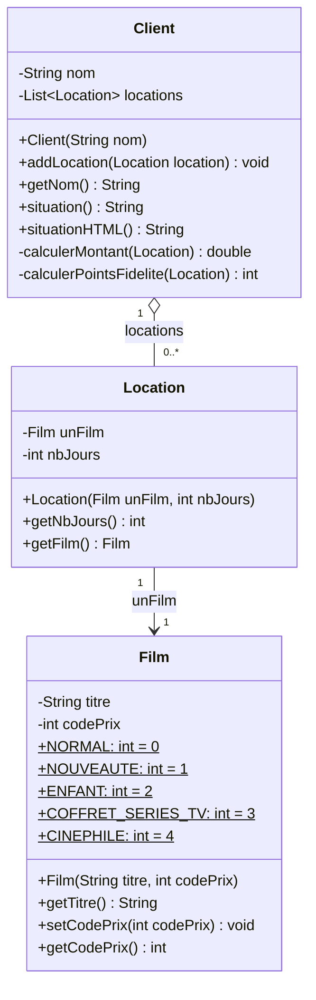
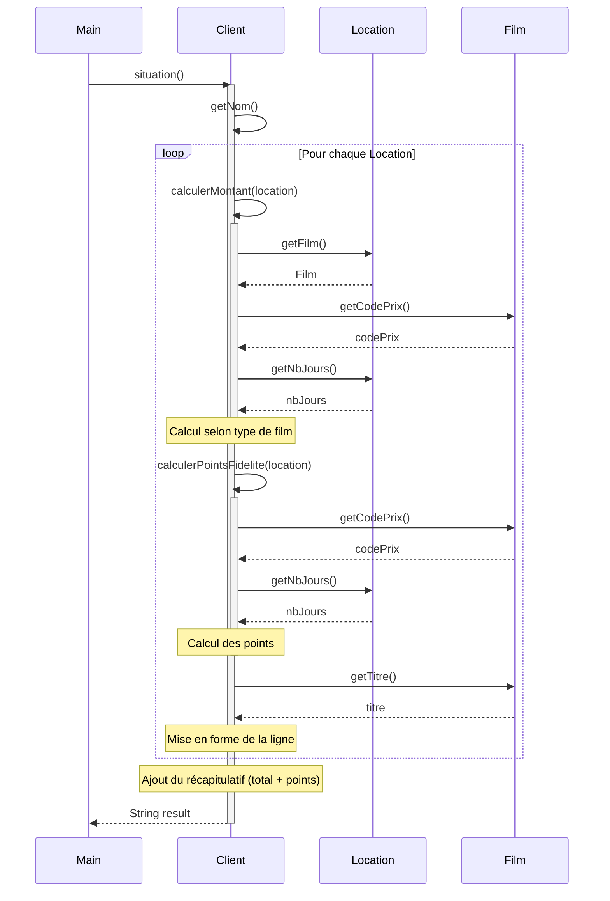

# Système de Location de Films - Documentation

## 1. Fonctionnalité principale

Ce code implémente un **système de gestion de locations de films** pour un vidéoclub. Il permet de :
- Gérer des clients et leurs locations de films
- Calculer le montant dû pour chaque location selon le type de film (5 catégories)
- Accumuler des points de fidélité
- Générer une situation récapitulative pour un client en **format texte** ou **HTML**

---

## 2. Règles métiers

### Tarification selon le type de film :

| Type de Film | Tarif de base | Supplément | Points fidélité |
|--------------|---------------|------------|-----------------|
| **NORMAL** | 2€ | +1.5€/jour au-delà de 2 jours | 1 point |
| **NOUVEAUTE** | 3€/jour | - | 1 point (+1 bonus si ≥2 jours) |
| **ENFANT** | 1.5€ | +1.5€/jour au-delà de 3 jours | 1 point |
| **COFFRET-SERIES-TV** | 0.50€/jour | - | 0 point |
| **CINEPHILE** | 2€ (1 jour) | +4€/jour dépassé | 3 points (si 1 jour) / 0 sinon |

### Détail des nouvelles catégories :

#### COFFRET-SERIES-TV
- Tarif fixe de **0.50€ par jour**, quel que soit le nombre de jours
- **Aucun point de fidélité** n'est accordé

#### CINEPHILE
- Tarif de base : **2€ pour 1 jour**
- Si le délai est dépassé : **+4€ par jour supplémentaire**
  - Exemple : 2 jours = 6€, 3 jours = 10€, 4 jours = 14€
- **3 points de fidélité** uniquement si la location est d'1 jour
- **0 point** si le délai d'un jour est dépassé

---

## 3. Diagramme de classes



**Multiplicités :**
- Un `Client` possède **0 à plusieurs** `Location` (agrégation)
- Une `Location` est associée à **exactement 1** `Film`

---

## 4. Diagramme de séquences



---

## 5. Tests unitaires

Le projet utilise **JUnit 5** avec **deux classes de tests** (une par méthode situation) :

| Classe de test | Méthode testée | Nombre de tests |
|----------------|----------------|-----------------|
| `ClientSituationTest` | `situation()` | ~30 tests |
| `ClientSituationHTMLTest` | `situationHTML()` | ~25 tests |

### Couverture des tests :

- ✅ Film NORMAL (≤2 jours, >2 jours, cas limites)
- ✅ Film NOUVEAUTE (1 jour, ≥2 jours avec bonus fidélité)
- ✅ Film ENFANT (≤3 jours, >3 jours)
- ✅ Film COFFRET-SERIES-TV (tarif 0.50€/jour, 0 points)
- ✅ Film CINEPHILE (1 jour avec bonus, dépassement sans bonus)
- ✅ Client sans location
- ✅ Cumul de plusieurs locations
- ✅ Format HTML valide (structure, styles, contenu)

---

## 6. Utilisation (Maven)

### Prérequis
- Java 17+
- Maven 3.6+

### Commandes

```bash
# Compiler le projet
mvn compile

# Exécuter les tests
mvn test

# Exécuter les tests avec rapport de couverture (JaCoCo)
mvn test jacoco:report
# Rapport disponible dans target/site/jacoco/index.html

# Lancer la démo
mvn exec:java

# Créer le JAR
mvn package
```

---

## Structure du projet

```
├── pom.xml                                    # Configuration Maven
├── README.md                                  # Cette documentation
└── src/
    ├── main/java/com/videoclub/
    │   ├── Client.java                        # Classe principale (situation + situationHTML)
    │   ├── Film.java                          # Représente un film avec son type/prix
    │   ├── Location.java                      # Association film-durée
    │   └── Scenario.java                      # Classe de démonstration
    └── test/java/com/videoclub/
        ├── ClientSituationTest.java           # Tests pour situation()
        └── ClientSituationHTMLTest.java       # Tests pour situationHTML()
```
